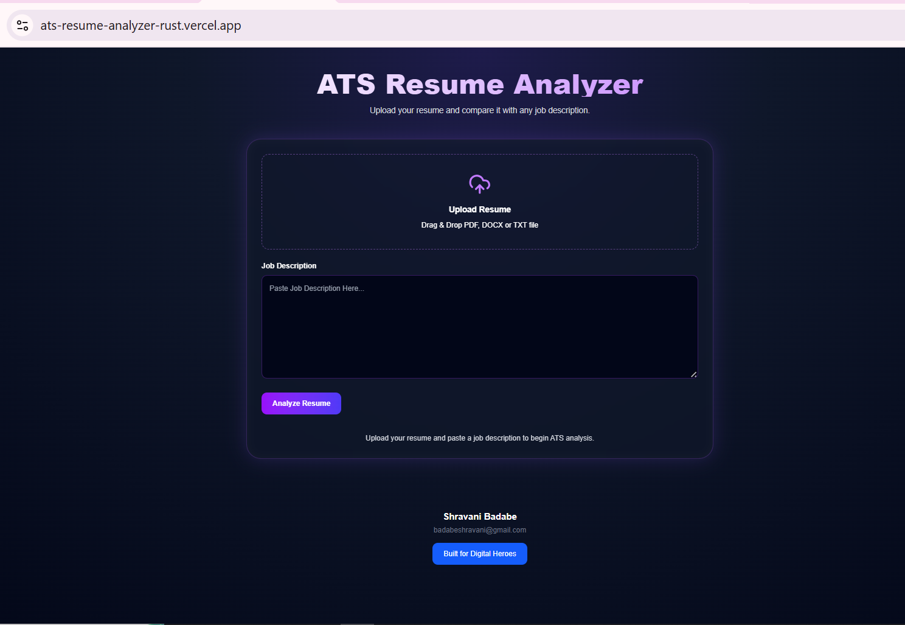
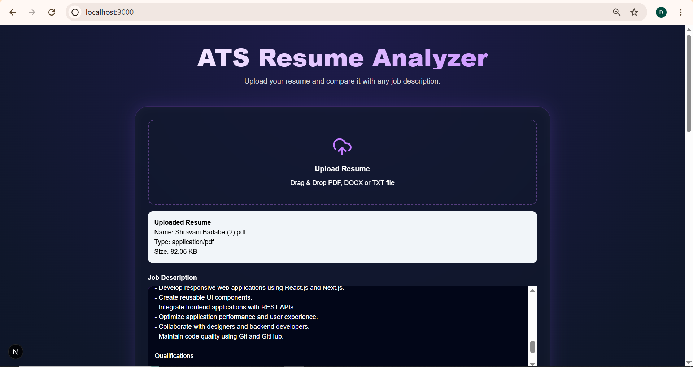
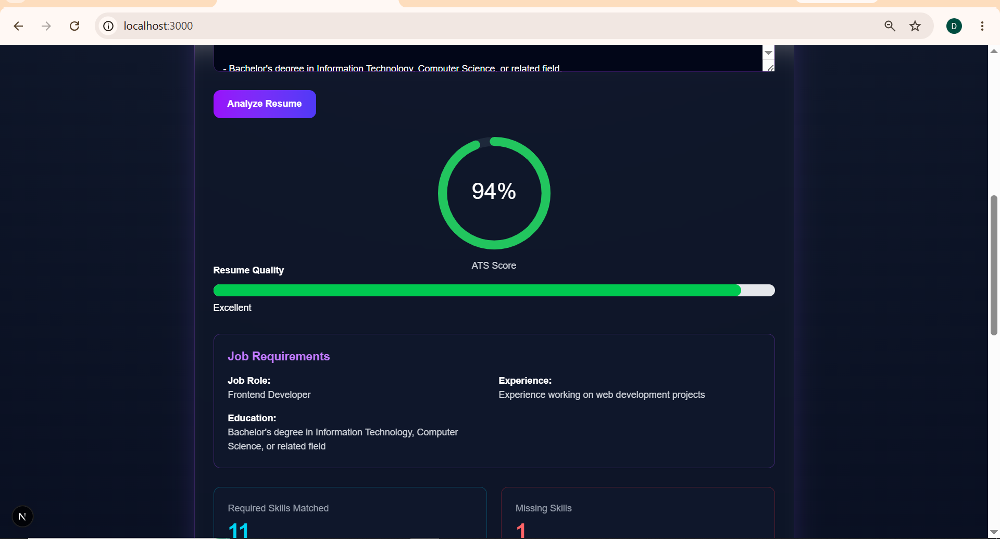
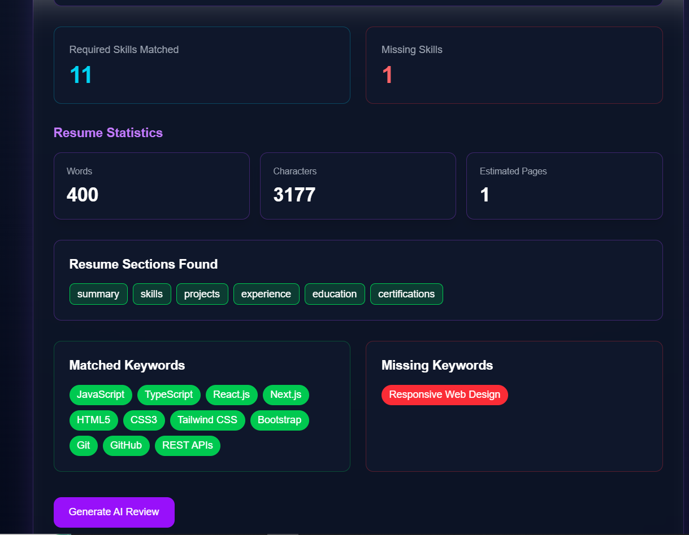
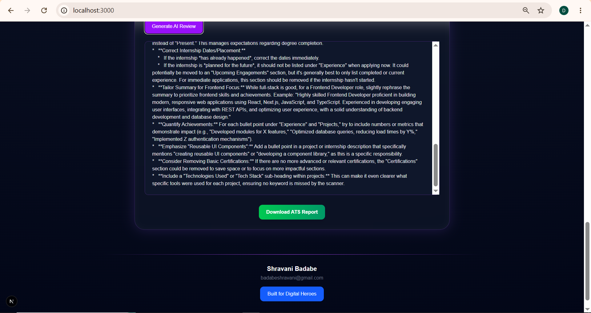

# 🚀 ATS Resume Analyzer


An AI-powered ATS (Applicant Tracking System) Resume Analyzer built with **Next.js**, **Google Gemini AI**, and **Tailwind CSS**.

This tool helps job seekers evaluate how well their resume matches a job description, identify missing skills, analyze ATS compatibility, and improve their chances of getting shortlisted by recruiters.

🌐 **Live Demo:** [https://ats-resume-analyzer-rust.vercel.app/](https://ats-resume-analyzer-rust.vercel.app/)

---

## ✨ Features

### 📄 Resume Upload

* Upload PDF resumes
* Upload DOCX resumes
* Upload TXT resumes
* Drag & Drop support

### 🤖 AI-Powered Job Description Analysis

* Uses Google Gemini AI
* Extracts important ATS requirements
* Detects:

  * Job Role
  * Required Skills
  * Preferred Skills
  * Experience Requirements
  * Education Requirements

### 📊 ATS Compatibility Score

* Calculates ATS Match Score
* Highlights matched skills
* Shows missing skills
* Resume section detection
* Resume quality analysis

### 📈 Resume Insights

* Word count
* Character count
* Estimated page count
* Resume quality indicator

### 📝 AI Resume Review

* Resume strengths
* Areas for improvement
* ATS optimization suggestions
* Recruiter-style feedback

### 📥 PDF Report Generation

* Download ATS analysis report
* Professional PDF format
* Easy to save and share

---

## 🛠️ Tech Stack

### Frontend

* Next.js 16
* React
* Tailwind CSS
* Framer Motion

### AI Integration

* Google Gemini 2.5 Flash

### Libraries

* pdfjs-dist
* mammoth
* jspdf
* react-dropzone
* react-hot-toast
* lucide-react

### Deployment

* Vercel

---

## 📸 Screenshots

### Home Page



### Resume Upload



### ATS Score Analysis



### Keyword Analysis



### AI Review & PDF Report



---

## ⚙️ Installation

### Clone Repository

```bash
git clone https://github.com/Shravanibadabe/ats-resume-analyzer.git
```

### Navigate to Project

```bash
cd ats-resume-analyzer
```

### Install Dependencies

```bash
npm install
```

### Create Environment Variables

Create a file named:

```env
.env.local
```

Add:

```env
GEMINI_API_KEY=YOUR_GEMINI_API_KEY
```

### Run Development Server

```bash
npm run dev
```

Open:

```text
http://localhost:3000
```

---

## 📂 Project Structure

```text
app/
│
├── api/
│   ├── review/
│   └── extract-keywords/
│
├── layout.js
├── page.js
│
components/
│
├── ATSAnalyzer.jsx
├── ATSScore.jsx
├── ResumeUploader.jsx
├── ResumeStats.jsx
├── ResumeQuality.jsx
├── KeywordAnalysis.jsx
├── ScoreBreakdown.jsx
├── SectionAnalysis.jsx
├── AIReview.jsx
├── DownloadReport.jsx
├── Footer.jsx
│
utils/
│
├── analyzer.js
├── pdfParser.js
├── docxParser.js
└── gemini.js
```

---

## 🎯 Problem Statement

Many candidates submit resumes without knowing whether they match the requirements of a job posting.

ATS Resume Analyzer helps users:

✅ Understand ATS compatibility

✅ Identify missing skills

✅ Improve resume quality

✅ Increase interview chances

✅ Get AI-powered feedback

---

## 🔐 Environment Variables

Required environment variable:

```env
GEMINI_API_KEY=YOUR_GEMINI_API_KEY
```

⚠️ Never commit `.env.local` to GitHub.

Add `.env.local` to `.gitignore`.

```gitignore
.env.local
.env
```

---

## 🚀 Deployment

This application is deployed on **Vercel Hobby Plan (Free)**.

### Deployment Steps

1. Push code to GitHub
2. Import repository into Vercel
3. Add `GEMINI_API_KEY` in Environment Variables
4. Deploy

Live URL:

**[https://ats-resume-analyzer-rust.vercel.app/](https://ats-resume-analyzer-rust.vercel.app/)**

---

## 👩‍💻 Author

### Shravani Badabe

📧 Email: badabeshravani@gmail.com

💼 LinkedIn:
https://www.linkedin.com/in/shravani-badabe

🌐 Portfolio:
https://shravanibadabe.netlify.app/

---

### About Me

I am a Full Stack Developer passionate about building AI-powered web applications using modern technologies such as React, Next.js, JavaScript, Tailwind CSS, Node.js, and Google Gemini AI.

I enjoy solving real-world problems through software development and continuously improving my skills in frontend development, backend development, and AI integration.

---

## 🏆 Digital Heroes Trial Project

This project was developed as part of the Digital Heroes Custom Software Developer Trial Task.

### Requirements Completed

✅ Working Online Tool

✅ Real ATS Analysis Output

✅ Public GitHub Repository

✅ Live Deployment on Vercel

✅ Built for Digital Heroes Button
(Links to https://digitalheroesco.com)

✅ Full Name & Email Displayed

✅ Portfolio Project

✅ ₹0 Development Cost

---

## 🌟 Live Application

### ATS Resume Analyzer

[https://ats-resume-analyzer-rust.vercel.app/](https://ats-resume-analyzer-rust.vercel.app/)

If you find this project useful, consider giving it a ⭐ on GitHub.
